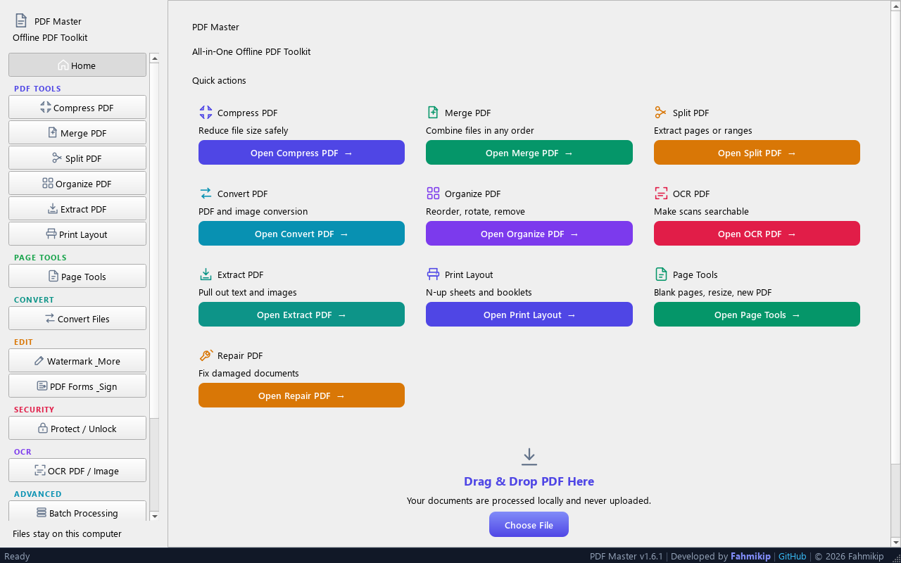
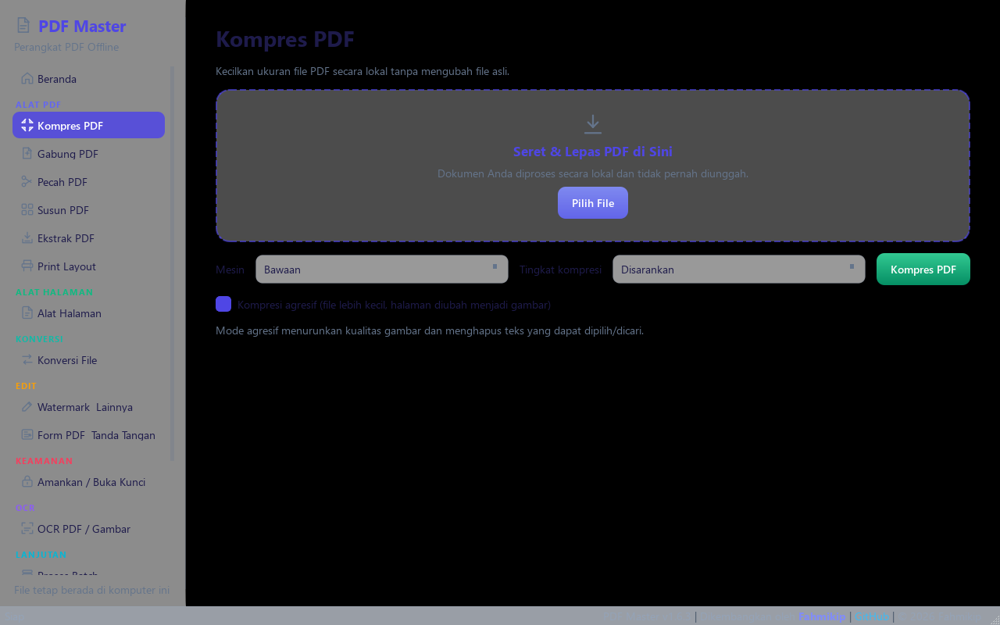
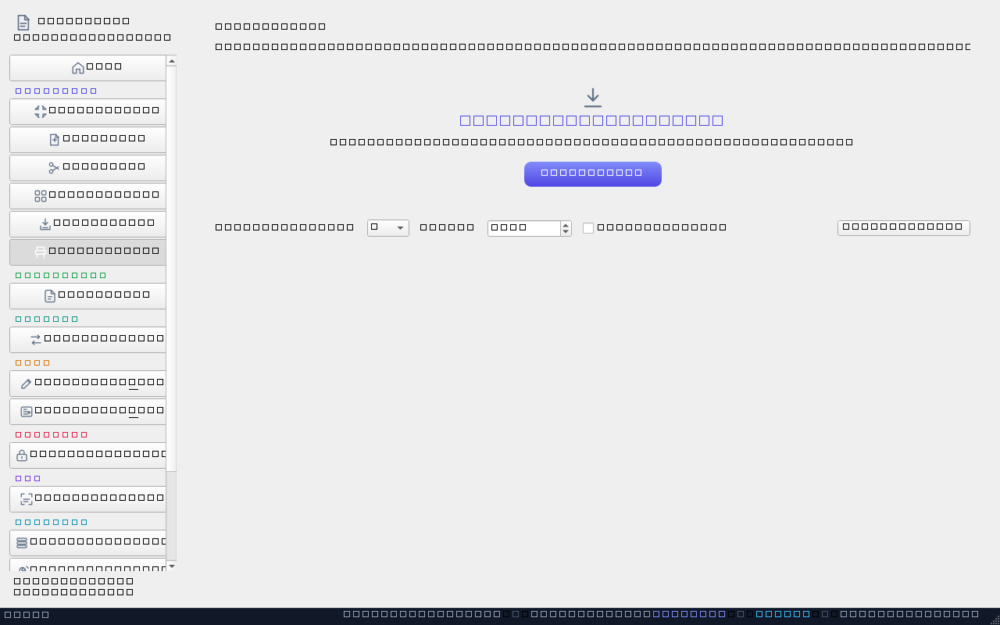
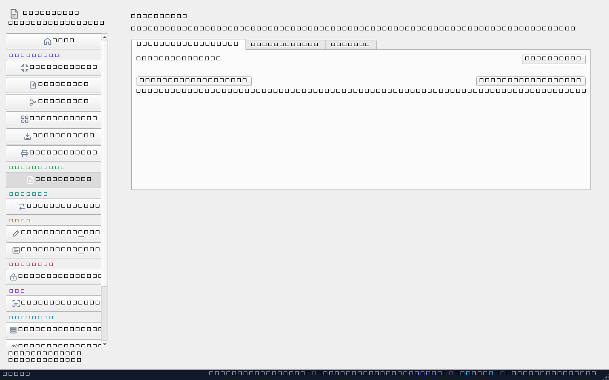
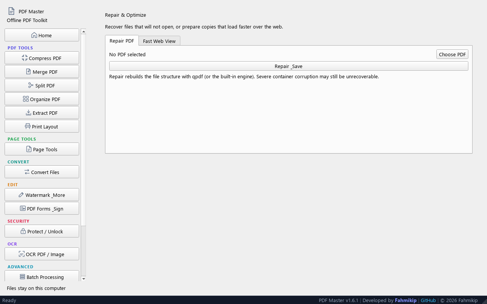
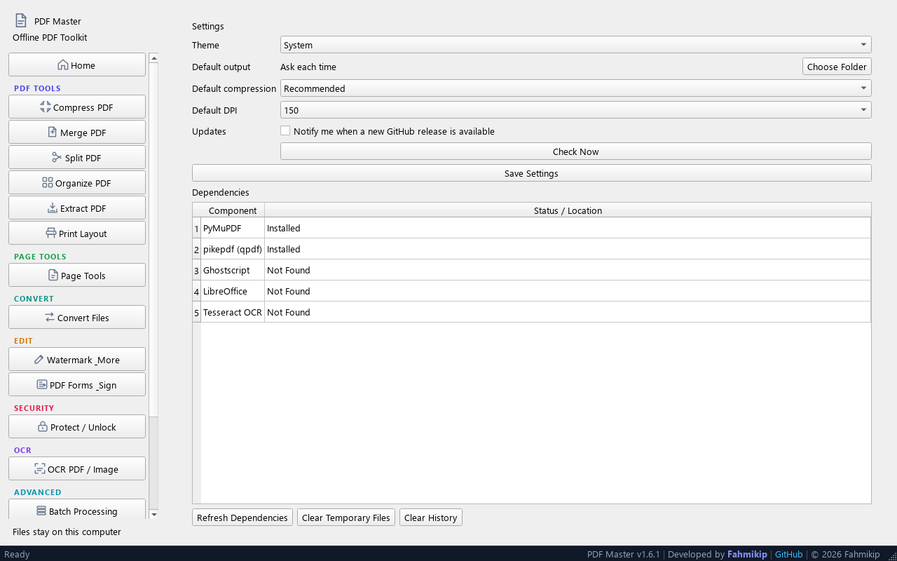

# PDF Master


**PDF Master** adalah perangkat PDF all-in-one untuk Windows yang berjalan sepenuhnya **offline**, dibangun dengan Python 3.12 dan PySide6. Semua operasi dokumen dijalankan di komputer Anda sendiri — tidak ada yang diunggah, dan tidak ada pelacakan atau telemetri.

Versi saat ini: **v1.6.3**

---

## Tangkapan Layar

| Beranda | Kompres PDF | Print Layout |
| --- | --- | --- |
|  |  |  |

| Page Tools | Repair & Optimize | Pengaturan |
| --- | --- | --- |
|  |  |  |

---

## Fitur

| Kategori | Alat | Fungsi |
| --- | --- | --- |
| Alat PDF | Kompres PDF | Perkecil ukuran file dengan profil Rendah / Disarankan / Tinggi / Maksimum; tiga mesin (Built-in, Lossless qpdf, dan Ghostscript untuk scan); mode agresif untuk file yang sudah optimal |
| Alat PDF | Gabung PDF | Gabungkan dua PDF atau lebih, atur urutan dengan drag |
| Alat PDF | Pecah PDF | Pecah per halaman, setiap N halaman, atau rentang tertentu (mis. `1-3, 5`) |
| Alat PDF | Susun PDF | Urut ulang, putar, dan hapus halaman |
| Alat PDF | Ekstrak PDF | Ekspor teks ke `.txt` atau gambar tertanam ke PNG / JPG / WEBP |
| Alat PDF | Print Layout | Susun 2–16 halaman per lembar (N-up) atau buat **booklet lipat-tengah** siap cetak bolak-balik |
| Konversi | Konversi File | Gambar→PDF, PDF→JPG/PNG/WebP, Word/Excel/PowerPoint→PDF (LibreOffice), PDF→Word, PDF→Excel |
| Edit | Watermark & Lainnya | Watermark teks/gambar, nomor halaman, header & footer, edit metadata, **Insert & Edit** (letakkan foto, geser, ubah ukuran, tambah teks dengan pilihan font, ukuran & warna) |
| Edit | PDF Forms & Signature | Isi formulir PDF interaktif (teks/centang), tambah tanda tangan visual (gambar + nama) atau **gambar tanda tangan langsung dengan mouse/touchscreen** |
| Keamanan | Lindungi / Buka Kunci | Proteksi kata sandi PDF dan buka kunci resmi |
| OCR | OCR PDF / Gambar | Buat hasil scan dapat dicari (memerlukan Tesseract) |
| Lanjutan | Proses Batch | Jalankan operasi yang sama untuk banyak file sekaligus |
| Lanjutan | Hapus Halaman Kosong | Deteksi dan hapus halaman blank (tanpa teks/gambar/vektor) sekaligus |
| Lanjutan | Ubah Ukuran Halaman | Fit / Fill / Stretch ke ukuran standar (A4, A3, A5, Letter, Legal) dengan margin |
| Lanjutan | PDF Baru | Buat dokumen kosong baru dari template ukuran standar |
| Lanjutan | Perbaiki & Optimalkan | Perbaiki PDF rusak (qpdf/pikepdf) dan ubah ke **Fast Web View (linearize)** agar cepat dibuka saat daring |
| Lainnya | Riwayat | Riwayat operasi lokal tanpa isi dokumen, lengkap dengan statistik penyimpanan |
| Lainnya | Pengaturan | Preferensi, deteksi LibreOffice / Tesseract, pemeriksaan pembaruan dengan unduh & pasang installer (selalu dengan izin Anda) |
| Lainnya | Tentang Developer | Informasi developer dan versi |

Semua hasil edit ditulis ke file **baru** — file asli Anda tidak pernah diubah.

## Persyaratan Sistem

- Windows 10/11 (64-bit)
- Python 3.12 atau 3.13 untuk menjalankan dari kode sumber
- Alat eksternal opsional (terdeteksi terpisah, tidak disertakan):
  - **LibreOffice** — konversi Office (Word/Excel/PowerPoint) → PDF
  - **Tesseract** — mesin OCR
  - **Ghostscript** — mesin kompresi tambahan (sangat baik untuk PDF hasil scan)

## Menjalankan dari Kode Sumber

```powershell
py -3.12 -m venv .venv
.venv\Scripts\Activate.ps1
pip install -r requirements.txt
python app\main.py
```

Jalankan rangkaian tes dengan `python -m pytest`.

## Cara Menggunakan

1. **Kompres PDF**
   Pilih **Kompres PDF** → seret file ke area drop → pilih tingkat kompresi → **Kompres PDF** → tentukan lokasi penyimpanan. Hasilnya terbuka di Explorer.

2. **Gabung PDF**
   Pilih **Gabung PDF** → tambahkan dua file atau lebih → seret dalam daftar sesuai urutan → **Gabung PDF**.

3. **Pecah / ekstrak halaman**
   Pilih **Pecah PDF** → pilih *Setiap halaman*, *Setiap N halaman*, atau *Rentang halaman* (mis. `1-3, 5`) → jalankan dan pilih folder keluaran.

4. **Ekstrak teks atau gambar**
   Pilih **Ekstrak PDF** → pilih *Teks ke .txt* (menyimpan file teks dengan penanda halaman) atau *Gambar ke file* (PNG/JPG/WEBP, dengan filter ukuran minimum).

5. **PDF ke Excel**
   Pilih **Konversi File** → pilih *PDF to Excel* → tambahkan PDF → pilih lokasi `.xlsx`. Tabel terdeteksi otomatis dan disusun sebagai grid kolom; teks dan gambar lainnya ditempatkan sesuai urutan.

6. **PDF ke Word**
   Pilih **Konversi File** → *PDF to Word* → tambahkan PDF → simpan sebagai `.docx`. Teks, baris dengan format (tebal/miring), tabel, dan gambar dipertahankan; tata letak yang sangat kompleks mungkin tidak sempurna.

7. **Lindungi atau buka kunci**
   Pilih **Lindungi / Buka Kunci** → atur kata sandi untuk mengenkripsi, atau berikan kata sandi yang benar untuk menghapus proteksi.

8. **OCR hasil scan**
   Pilih **OCR PDF / Gambar** → arahkan PDF Master ke instalasi Tesseract jika diperlukan, lalu pilih scan agar dapat dicari.

9. **Isi formulir PDF**
   Pilih **PDF Forms & Signature** → pilih PDF → masukkan nilai baru di kolom *New Value* untuk tiap field → **Save Filled PDF**.

10. **Tanda tangan visual**
    Pilih **PDF Forms & Signature** → tab *Sign Document* → pilih PDF + gambar tanda tangan → atur halaman & posisi → **Sign PDF**.

11. **Editor objek (Insert & Edit)**
    Pilih **Edit PDF** → tab *Insert & Edit* → pilih PDF → **Add Image** untuk foto (JPEG/JPG/PNG) atau **Add Text** untuk teks. Geser objek untuk memindah posisi, tarik titik sudut untuk mengubah ukuran gambar, pilih font/ukuran/warna di panel, pilih halaman, lalu **Save PDF**.

12. **Tanda tangan tulisan tangan**
    Pilih **PDF Forms & Signature** → tab *Sign Document* → centang **Draw signature with mouse / touch** → gambarlah tanda tangan di papan → pilih halaman & posisi → **Sign PDF**.

13. **Print layout & booklet**
    Pilih **Print Layout** → pilih PDF → atur *Pages per sheet* (2–16) atau centang *Booklet (fold)* → **Create Layout**. Cetak hasilnya bolak-balik dan lipat agar menjadi buklet.

14. **Hapus halaman kosong / ubah ukuran / PDF baru**
    Pilih **Page Tools**. Tab *Remove Blank Pages* untuk membuang halaman blank, tab *Resize Pages* untuk menyetel ulang ke ukuran standar, atau tab *New PDF* untuk membuat dokumen kosong.

15. **Perbaiki & Fast Web View**
    Pilih **Repair & Optimize** → tab *Repair PDF* untuk memulihkan file rusak, atau tab *Fast Web View* untuk membuat salinan yang termuat cepat di browser.

## FAQ

### Windows menampilkan "Windows protected your PC" / "Unknown publisher" saat menjalankan PDF Master
Itu **normal** dan bukan virus. PDF Master tidak ditandatangani dengan sertifikat EV, sehingga Windows SmartScreen belum mengenali pengembangnya. Untuk menjalankan: klik **More info** → **Run anyway**. Hindari men-download build dari sumber selain halaman **Releases** resmi.

### Antivirus tiba-tiba menandai PDFMaster.exe
Karena aplikasi ini dikemas dengan **PyInstaller** (bundling Python + pustaka ke satu `.exe`), beberapa antivirus terkadang melaporkan *false positive*. Build **v1.6.1+** sudah mematikan kompresi **UPX** yang sering memicu heuristik antivirus, sehingga deteksi palsu berkurang drastis. Jika masih terdeteksi: pastikan file berasal dari halaman **Releases** resmi, bandingkan *checksum* sha256 yang tercantum di rilis, dan tambahkan pengecualian di antivirus Anda.

### Apakah perlu LibreOffice / Tesseract?
Tidak wajib. Keduanya **opsional** dan hanya dibutuhkan bila Anda ingin:
- **LibreOffice** — konversi Word/Excel/PowerPoint → PDF;
- **Tesseract** — membuat hasil scan dapat dicari (OCR).
Alat PDF lainnya berjalan tanpa instalasi tambahan.

### Apakah file asli saya bisa berubah?
Tidak. Semua hasil operasi ditulis ke **file baru**; file asli tidak pernah ditimpa. UI bahkan menolak lokasi keluaran yang sama dengan sumber.

### Apakah dokumen saya terunggah?
Tidak. Semua pemrosesan terjadi **lokal** di komputer Anda. Pemeriksaan pembaruan hanya menanyakan nomor versi ke GitHub dan selalu atas izin Anda.

## Membangun Rilis Portable

```powershell
build.bat            # menjalankan tes, menyiapkan aset, membangun dist\PDF-Master\PDFMaster.exe
installer.bat        # tambahan: membangun installer Inno Setup (memerlukan Inno Setup 6)
```

## Privasi

PDF Master memproses dokumen secara **lokal**. Tidak ada telemetri atau analitik, dan tidak mengunggah isi dokumen, nama file, maupun aktivitas. Pemeriksaan pembaruan opsional hanya menanyakan nomor versi ke GitHub; unduhan tidak pernah terjadi tanpa izin Anda.

## Developer

Dikembangkan oleh **Fahmikip** · https://github.com/fahmikip · © 2026 Fahmikip

Build portabel Windows: lihat halaman **Releases**.

## Berkontribusi

Dilisensikan di bawah **MIT**. Lihat [CONTRIBUTING.md](CONTRIBUTING.md) untuk panduan pengembangan, [SECURITY.md](SECURITY.md) untuk kebijakan keamanan, dan [CHANGELOG.md](CHANGELOG.md) untuk riwayat rilis.